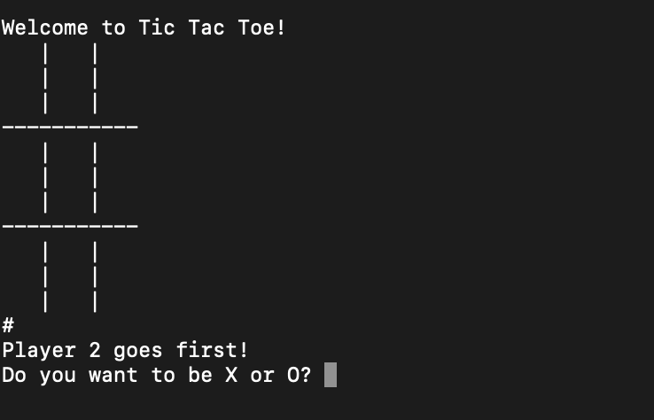

# Tic-Tac-Toe

## Description

This is a Command Line Interface Tic-Tac-Toe Game. This application was built using Python.

## Table of Contents

* [Description](#description)
* [User Story](#user-story)
* [Installation](#installation)
* [Usage](#usage)
* [License](#license)
* [Contributing](#contributing)
* [Tests](#tests)
* [Questions](#questions)
* [Deployed Application URL](#deployed-application-URL)

## User Story

As a user, I would like a tic tac toe game I can play with another user.

## Installation

Do a git fork and clone. In the command line, go to the project directory and type on python and then name of the file.

## Usage

On game launch, the applicaton will randomly choose which player will go first. That player will choose if they want to be X or O. Then the player will choose the space they would like to place their marker by typing in a number between 1-9. Gameboard is based on the standard number keyboard pad. The player that gets three of their marker in a row wins. If there is no winner, the game is a draw.

## License

## Contributing

Please follow standard contributing guidelines.

## Tests

No tests to run.

## Questions

For any questions, please contact kendayao at kendayao@gmail.com

## Deployed Application URL

Application Demo Video Link: https://www.youtube.com/watch?v=gWVsONU9xxo

